# latent-factozied-flow

NeurIPS23 "[Flow Factorized Representation Learning](https://arxiv.org/abs/2309.13167)" 

T-PAMI Submission "[Unsupervised Representation Learning from Sparse Transformation Analysis](https://arxiv.org/abs/2410.05564)"


| MNIST        |                    Shapes3D                     |  Falcol3D  | Isaac3D |
|:-------------------------:|:-------------------------------------------:|:-------------------------:|:-------------------------:|
|<br> <br>|  <br> <br>  |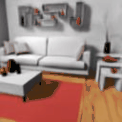| 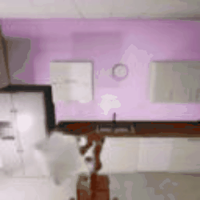  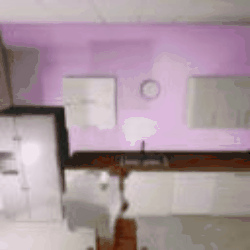 |

**CalMS**
| Latent Flow 1 |Latent Flow 2 |Latent Flow 3 |
|:-------------------------------------------:|:-------------------------------------------:|:-------------------------------------------:|
|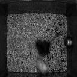 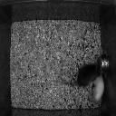|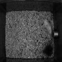 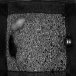|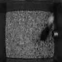 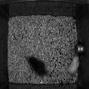|

**CityScape**
| Latent Flow 1 |Latent Flow 2 |Latent Flow 3 |
|:-------------------------:|:-------------------------:|:-------------------------:|
|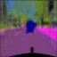 |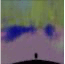||


## Overview 

### Conference Version (Supervised and Weakly-Supervised)
<p align="center">
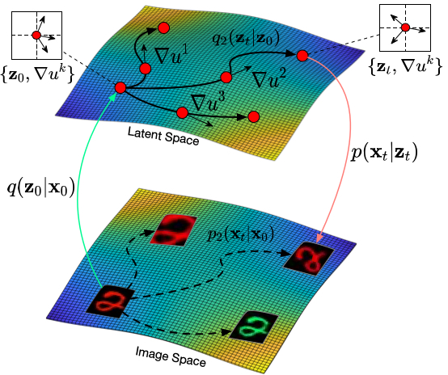
<br>
Illustration of our flow factorized representation learning: at each point in the latent space we have a distinct set of tangent directions ∇uk which define different transformations we would like to model in the image space. For each path, the latent sample evolves to the target on the potential landscape following dynamic optimal transport.
</p>

<p align="center">
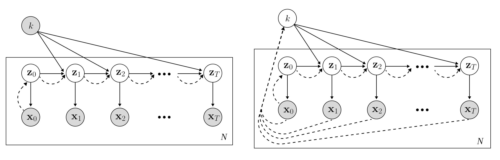
<br>
Depiction of our model in plate notation. (Left) Supervised, (Right) Weakly-supervised. White nodes denote latent variables, shaded nodes denote observed variables, solid lines denote the generative model, and dashed lines denote the approximate posterior. We see, as in a standard VAE framework, our model approximates the initial one-step posterior p(z0|x0), but additionally approximates the conditional transition distribution p(zt|zt−1, k) through dynamic optimal transport over a potential landscape.
</p>

### Journal Version (Unsupervised)
<p align="center">
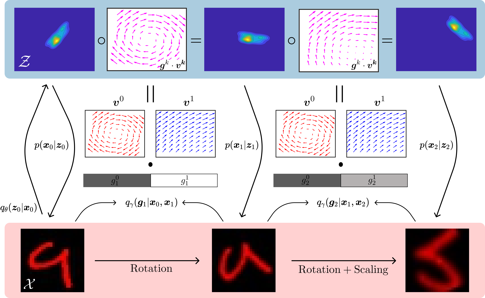
<br>
Overview of Sparse Transformation Analysis (STA): given an input sequence $\{\mathbf{x}_t\}_t^T$ containing some unknown combination of transformations, the model infers both an initial distribution over latent variables $q_{\theta}(\mathbf{z}_0|\mathbf{x}_0)$, and a sparse coefficient vector for each time-step $\mathbf{g}_t  = \{g_t^0, g_t^1, \ldots, g_t^K\}$ which is used to linearly combine the K distinct learned vector fields $\mathbf{v}^k = (\nabla u^k + \mathbf{r}^k)$ in order to compute the latent transformation from $\mathbf{z}_t$ to $\mathbf{z}_{t+1}$. Due to the sparsity of $\mathbf{g}$, the model learns to disentangle the observed transformations into separate flow fields $\mathbf{v}^k$ entirely unsupervised.
</p>

<p align="center">
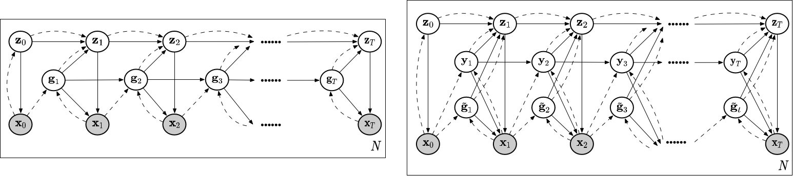
<br>
Our model across $N$ sequences in plate notation (Left) and a detailed version with decomposed spike and slab components (Right). White nodes denote latent variables, shaded nodes denote observed variables, solid lines denote the generative model, and dashed lines denote the approximate posterior. Different from the spike component $\mathbf{y}_t$, the slab variable $\tilde{\mathbf{g}}_t$ is independent across timesteps.
</p>

## Setup
First, clone the repository and navigate into it:

```bash
git clone https://github.com/KingJamesSong/latent-flow.git
cd latent-flow
```

We recommend setting up a new conda environment for this project. You can do this using the following command:

```bash
conda create --name latent-flow-env python=3.11
conda activate latent-flow-env
```

Next, install the necessary dependencies. This project requires PyTorch. You can find the installation instructions on the [PyTorch setup page](https://pytorch.org/get-started/locally/).


After installing PyTorch, install the remaining dependencies from the `requirements.txt` file:

```bash
pip install -r requirements.txt
```

For development purposes, you may also want to install the dependencies listed in `requirements_dev.txt`:

```bash
pip install -r requirements_dev.txt
```
It is recommended to set your IDEs autoformatter to use *black* and to enable "format on save".

Finally, install the package itself. If you plan on modifying the code, install it in editable mode using the `-e` option:

```bash
pip install -e .
```
This will allow your changes to be immediately reflected in the installed package.

The code assumes that all datasets are placed in the `./data` folder. This folder is going to be created automatically if necessary. 
However, if you'd like to use a different folder for your datasets, you can create a symbolic link to that folder. This can be done using the following commands:

For Unix-based systems (Linux, MacOS), use the `ln` command:
```bash
ln -s /path/to/your/dataset/folder ./data
```
This command creates a symbolic link named `./data` that points to `/path/to/your/dataset/folder`.

For Windows systems, use the `mklink` command:
```cmd
mklink /D .\data C:\path\to\your\dataset\folder
```
This command creates a symbolic link named `.\data` that points to `C:\path\to\your\dataset\folder`.

Please replace `/path/to/your/dataset/folder` and `C:\path\to\your\dataset\folder` with the actual path to your dataset folder.

## Usage

Please check [the scripts folder](https://github.com/KingJamesSong/latent-flow/tree/main/scripts) for the training and evaluation codes.

## Minimal Code for Spike-and-Slab Prior

Please check [latent_flow.py](https://github.com/KingJamesSong/latent-flow/blob/main/latent_flow.py) for the minimal training code of using the spike-and-slab prior.

We pre-define 3 latent flow fields and you just need to use your own MLP for it.

## Citation

If you think the code is helpful to your research, please consider citing our paper:

```
@inproceedings{song2023flow,
  title={Flow Factorized Representation Learning},
  author={Song, Yue and Keller, Andy and Sebe, Nicu and Welling, Max},
  booktitle={NeurIPS},
  year={2023}
}
@article{song2024unsupervised,
  title={Unsupervised Representation Learning from Sparse Transformation Analysis},
  author={Song, Yue and Keller, Thomas Anderson and Yue, Yisong and Perona, Pietro and Welling, Max},
  journal={arXiv preprint arXiv:2410.05564},
  year={2024}
}
```

If you have any questions or suggestions, please feel free to contact me via `yue.song@unitn.it`.
