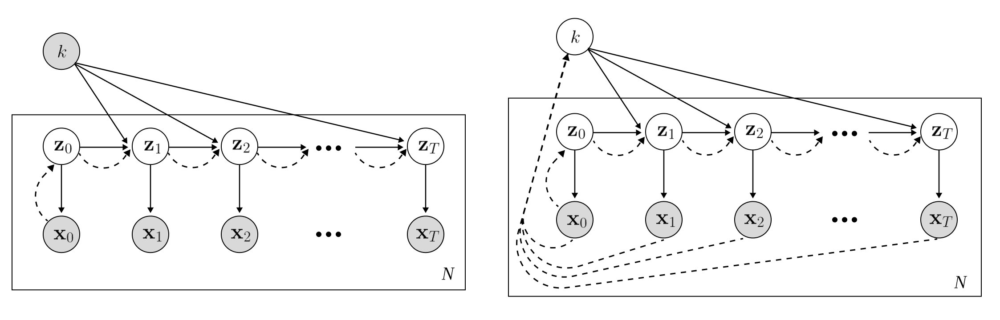

# latent-factozied-flow
NeurIPS23 "Flow Factorized Representation Learning"

[Yue Song](https://kingjamessong.github.io/)<sup>1,2</sup>, [T. Anderson Keller](https://scholar.google.com/citations?hl=en&user=Tb86kC0AAAAJ)<sup>1</sup>, [Nicu Sebe](https://scholar.google.com/citations?user=stFCYOAAAAAJ&hl=en)<sup>2</sup>, [Max Welling](https://scholar.google.com/citations?user=8200InoAAAAJ&hl=en)<sup>1</sup>  
<sup>1</sup>University of Amsterdam, the Netherlands <br>
<sup>2</sup>University of Trento, Italy <be> 

## Overview

<p align="center">

<br>
Illustration of our flow factorized representation learning: at each point in the latent space we have a distinct set of tangent directions ∇uk which define different transformations we would like to model in the image space. For each path, the latent sample evolves to the target on the potential landscape following dynamic optimal transport.
</p>

<p align="center">

<br>
Depiction of our model in plate notation. (Left) Supervised, (Right) Weakly-supervised. White nodes denote latent variables, shaded nodes denote observed variables, solid lines denote the generative model, and dashed lines denote the approximate posterior. We see, as in a standard VAE framework, our model approximates the initial one-step posterior p(z0|x0), but additionally approximates the conditional transition distribution p(zt|zt−1, k) through dynamic optimal transport over a potential landscape.
</p>

## Usage

Please check [the scripts folder](https://github.com/KingJamesSong/latent-flow/tree/main/scripts) for the training and evaluation codes.

## Citation

If you think the code is helpful to your research, please consider citing our paper:

```
@inproceedings{song2023flow,
  title={Flow Factorized Representation Learning},
  author={Song, Yue and Keller, Andy and Sebe, Nicu and Welling, Max},
  booktitle={NeurIPS},
  year={2023}
}
```

If you have any questions or suggestions, please feel free to contact me via `yue.song@unitn.it`.
